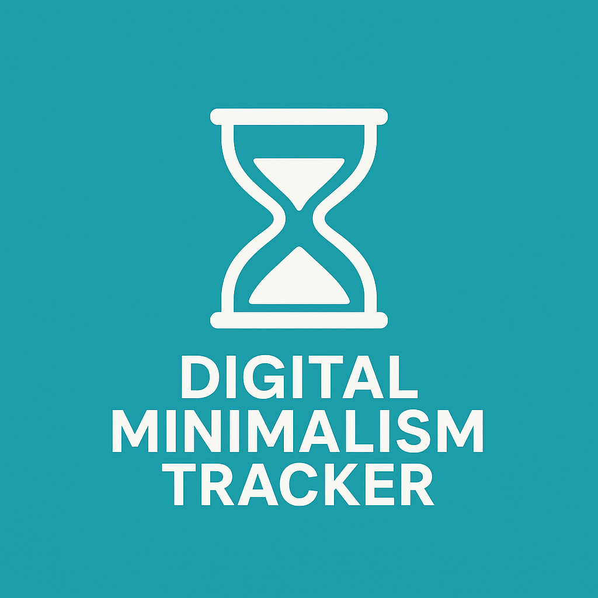

<p align="center">
  
</p>

<h1 align="center">Digital Minimalism Tracker</h1>

<p align="center">
  A simple dashboard I built to manually track how much time I spend on different apps each day.<br>
  It helps me stay aware of my screen time and avoid distractions.
</p>

<p align="center">
  <a href="LICENSE"></a>
  <a href="https://www.python.org/"></a>
  <a href="https://digital-minimalism-tracker-alt.streamlit.app/"></a>
  <a href="https://github.com/ranahitesh07/Digital-Minimalism-Tracker"></a>
</p>

---

## 🧠 Why I Made This

I was spending a lot of time online and wanted to be more mindful of it.  
So I made this app to log how long I use apps like YouTube, Chrome, etc. every day — manually.  
Yes, manually — because typing it makes me more aware than background tracking.

## 🔥 Live Demo

👉 [Launch the Web App](https://digital-minimalism-tracker-alt.streamlit.app/)

---

## ✨ Features

- ✅ Web-based manual logging of screen time
- 📊 Visualize app usage per day with charts
- 💾 Download usage data as CSV
- ➕ Create empty table for today
- 🧹 Clear today’s data with one click
- ☁️ Deployed on Streamlit Cloud

---

## 🗂️ Project Structure

```
Digital-Minimalism-Tracker/
├── app.py                 # Streamlit web dashboard
├── logger.py              # CLI logging script (optional)
├── main.py                # CLI interface (optional)
├── report.py              # CLI graph script (optional)
├── digital_usage.json     # Screen time data (JSON format)
├── logo.png               # App logo
├── requirements.txt       # Python dependencies
└── README.md              # Project documentation
```

---

## 🚀 Getting Started

### 1. Clone this repository

```bash
git clone https://github.com/ranahitesh07/Digital-Minimalism-Tracker.git
cd Digital-Minimalism-Tracker
```

### 2. Install dependencies

```bash
pip install -r requirements.txt
```

### 3. Run the app locally

```bash
streamlit run app.py
```


## 🧠 Ideas for Future

- Weekly usage trends
- App categorization (Productive / Distracting)
- Reminders or usage limits
- Multi-user tracking with login

---

## 📄 License

MIT LICENSE — feel free to use, modify, or fork this.

---

## 🙌 Acknowledgement

Inspired by *Digital Minimalism* by Cal Newport.  
This is mostly a personal habit tracker — but I hope it helps others too.
